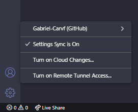
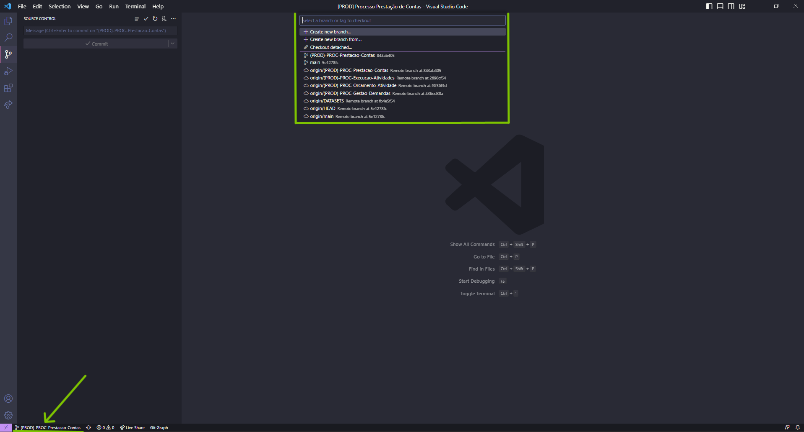
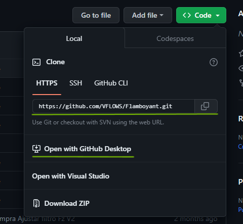
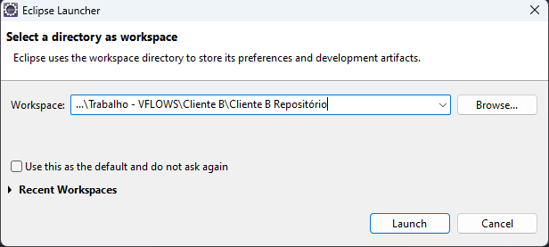
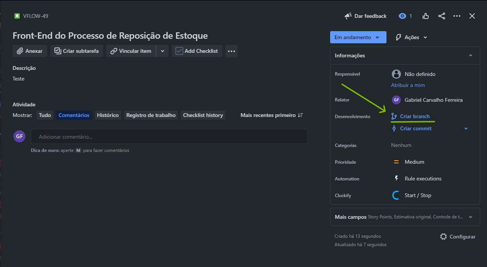
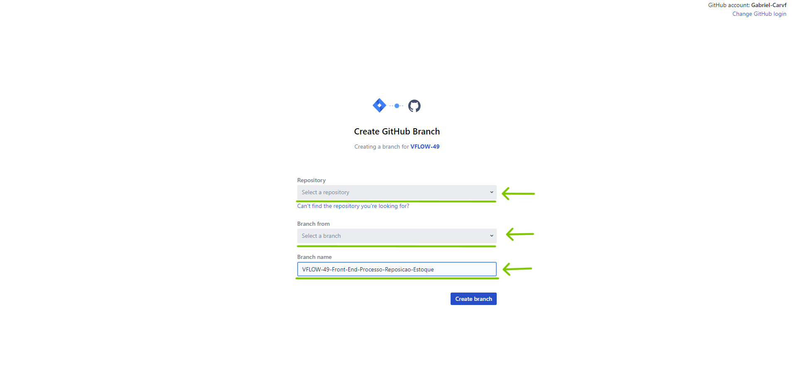
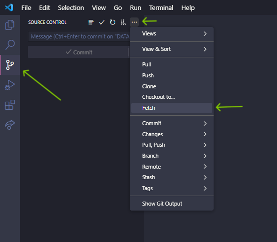
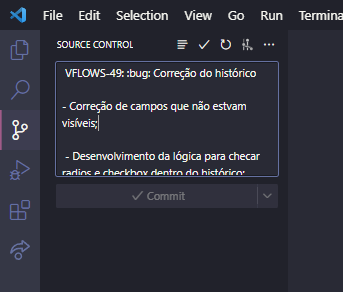

# **VFLOWS - Versionamento do código no GitHub**

## Criação de uma conta no GitHub
- [**Criação da conta**](#Criação-da-Conta)

- [**Configuração da conta no desktop**](#Configuração-da-conta-no-desktop)

## Baixando um repositório e importando o projeto para o eclipse
- [**Sugestão de organização de pastas**](#Sugestão-de-organização-de-pastas)

- [**Como baixar um repositório**](#Como-baixar-um-repositório)

- [**Importando um projeto para dentro do eclipse**](#Importando-um-projeto-para-dentro-do-eclipse)

## Criação de uma branch e comitando alterações
- [**Hierarquia e padrão de nomenclatura das branchs**](#Hierarquia-e-padrão-de-nomenclatura-das-branchs)

- [**Criação de uma branch a partir do Jira**](#Criação-de-uma-branch-a-partir-do-Jira)

- [**Fazendo um commit vinculado ao Jira e padrão de nomenclatura**](#Fazendo-um-commit-vinculado-ao-Jira-e-padrão-de-nomenclatura)

- [**Fazendo rebase e merge da branch pai**](#Fazendo-rebase-e-merge-da-branch-pai)

<br>

## Criação de uma conta no GitHub
* ### **Criação da Conta**:  
  Acesse o site [github.com](https://github.com/). Crie uma conta utilizando o email empresarial da VFLOWS. Ex: seunome@vflows.com.br. Após ter criado a conta vamos vincular o usuário à empresa e incluir os acessos aos repositórios, a partir disso as branchs ficarão disponíveis para clonar.'

 <br>

* ### **Configuração da conta no desktop**:  
  Estar com o usuário do GitHub logado na máquina é necessário para começar a trabalhar com os repositórios dos clientes.  

  Caso utilize o [Visual Studio Code](https://code.visualstudio.com/) como ferramenta para edição de código (altamente recomendável), é possível fazer o login e sincronizar a conta do GitHub por ele.

  No canto inferior esquerdo do aplicativo terá a opção para fazer login. Segue imagem de exemplo:

  

  Outro ponto importante é ter o [Git](https://git-scm.com/downloads) instalado na máquina e ele estar configurado com seu e-mail e nome de usuário corretos. Segue exemplo de código para configuração:  

  ``` bash
  $ git config --global user.email "seunome@vflows.com.br"

  $ git config --global user.name "Seu Nome"
  ```

  Caso você não queira definir esses parâmetros de forma global tem alternativas, como definir apenas para um repositório ou pasta específica. Basta navegar até diretório e executar o comando sem a tag `--global`.

<br>

## Baixando um repositório e importando o projeto para o eclipse
* ### **Sugestão de organização de pastas**:  
  A organização e estruturação das pastas é importante para não perder o controle das informações, além de facilitar no momento que houver necessidade de procurar projetos/códigos ou qualquer outra informação. 

  Uma sugestão é criar uma pasta específica para o trabalho, dentro dessa pasta conter pastas específicas de cada cliente para armazenar documentações, imagens e qualquer arquivo que seja referente ao cliente.

  Dentro desta pasta específica do cliente também é aconselhável a criação de uma pasta para servir como workspace do Eclipse e para ser um repositório dos projetos daquele cliente.  

  Segue exemplo de estruturação:
  ``` 
  ...\Trabalho - VFLOWS
        Cliente A
        Cliente B
          projetoA.pdf
          vpn.open
          teste.txt
          Cliente B Repositório
            Processo de Desligamento
            Processo de Faturamento
            Processo de Compra
            Widget de Cadastro
        Cliente C
        Cliente D
  ```

  Lembrando que cada pasta dentro de `Cliente B Repositório` é uma branch vinda do GitHub.  

   <br>

* ### **Como baixar um repositório**:  
  A forma mais simples de fazer o clone do repositório é por uma linha de comando no bash/terminal.
  
  Navegue até a pasta desejada, no exemplo seria a `Cliente B Repositório`, e execute o seguinte comando:

  ``` bash
  git clone 'https://github.com/VFLOWS/ClienteB.git'
  ```  

  Após a execução desse comando a branch `main` do cliente estará clonada. Logo, basta abrir a pasta que acabou de ser gerada com o Visual Studio Code e alterar para a branch que deseja trabalhar.

  Exemplo de como alterar a branch:

  

  Caso tenha dificuldade em clonar o repositório pelo terminal/bash é recomendado usar a aplicação [GitHub Desktop](https://desktop.github.com/).  

  Opções para fazer o clone do repositório:

  

 <br>

* ### **Importando um projeto para dentro do eclipse**:  
  Para importar um projeto para o [Eclipse](https://www.eclipse.org/downloads/packages/release/oxygen/r) primeiramente é necessário que o projeto esteja dentro da pasta que será o workspace do Eclipse.

  * Selecionando a pasta que será o workspace:
  
    

  * Com o Eclipse aberto selecione opção `Importar` (basta clicar com o botão direito no 'Package Explorer' ou clicar no botão 'File' no canto superior esquerdo);

  * No menu de importação selecione a opção `Projects from Git`;

  * Selecione a origem do repositório, que será `Existing local repository`;
  
  * Selecione o repositório;
  
  * Selecione o tipo de importação que irá fazer, que será `Import existing Eclipse projects`;

  * Nesse último passo basta selecionar o projeto e clicar no botão `Finish`.

Após esses passos o projeto estará devidamente importado no Eclipse e pronto para ser modificado.

  <br>

## Criação de uma branch e comitando alterações
* ### **Hierarquia e padrão de nomenclatura das branchs**:  
  Visando uma melhor organização é necessário que as branchs tenham uma padronização mínima e uma hierarquia.

  Cada cliente tem seu próprio repositório e este é iniciado com uma branch `main` que abriga a estruturação de pastas e arquivos de um projeto em branco do Eclipse. **Essa branch nunca será alterada**! Ela serve como base para criar as branchs de cada projeto do cliente.

  Para cada projeto do cliente será criada uma branch específica. Exemplo: o Cliente A precisa de um processo de reposição de estoque e uma widget para cadastrar produtos. Nesse caso será criada duas branchs para cada um dos projetos:

  ```
  (TESTE)-PROC-Reposicao-Estoque

  (TESTE)-WD-Cadastro-Produtos
  ```
  Essas serão as branchs 'pai' de cada projeto. Lembrando que no momento da criação essas branchs serão baseadas na `main`.

  A nomenclatura das branchs 'pai' seguem um padrão para melhor organização, seguir esse padrão é obrigatório. Sendo ele:

  * `(TESTE)` - Servidor que a branch pertence. Podemos ter:
    - `(TESTE)`;
    - `(HOMOLOG)`;
    - `(PROD)`.
  
  <br>

  * `PROC` - Informa qual o tipo de projeto, se é uma Widget ou Processo:
    - `PROC`;
    - `WD`.
   
  <br>

  * `Reposicao-Estoque` - Essa é a última informação e refere-se ao nome do projeto.
    - Uma boa prática é retirar os acentos e as preposições. Assim como está no exemplo.  
   
  <br>
  
  Cada uma dessas propriedades devem ser separadas por um hífen `-` .

  <br>

* ### **Criação de uma branch a partir do Jira**:  
  Tendo criado a branch 'pai' do projeto podemos partir para a criação das branchs de desenvolvimento daquele projeto.

  A ferramenta de gestão utilizada pela VFLOWS é o [Jira](https://www.atlassian.com/br/software/jira). Teremos todas as etapas de desenvolvimento do projeto dentro de cards no Jira. A partir desses cards é possível criar as branchs de desenvolvimento.

  Passos para criar uma branch através de um card:

  *  Selecione o card que deseja e clique em "Criar Branch";  
    
      
     
  <br>

  * Selecione o Repositório do cliente, a branch 'pai' do projeto e **não esqueça de conferir o nome da branch** que está criando. Não há problemas em modificar o nome, porém é obrigatório que a branch comece com o código do card por exemplo: '`VFLOWS-49`', além de que precisa ter o nome do projeto '`Processo-Reposicao-Estoque`' e uma breve descrição do que se trata a branch '`desenvolvimento-front-end`'.  
  
    

    Após ter conferido todas as informações clique no botão 'Create branch'.
   
  <br>

  * Para começar a atuar na branch criada abra a pasta do projeto no Visual Studio Code, vá na aba 'Source Control', faça um fetch e a branch nova irá ficar disponível para ser selecionada. Lembrando que é necessário estar com a conta do GitHub logada no Visual Studio Code.  
  
    

<br>

* ### **Fazendo um commit vinculado ao Jira e padrão de nomenclatura**:  
  Os commits são fundamentais para termos um histórico organizado das alterações feitas no código do projeto.   

  Não há uma regra fixa de quando se deve fazer os commits durante o desenvolvimento. O desenvolvedor pode optar por fazer commits pequenos (a cada pequena alteração), fazer commits quando houver um avanço significativo no desenvolvimento ou ao final de cada dia. O importante é termos a rastreabilidade do que está acontecendo no código.

  Para vincular o commit ao card do Jira que está sendo desenvolvido **`é necessário sempre informar o código do card no começo do título do commit`**. 

  Além disso existem algumas regras e boas práticas para a nomenclatura do commit, que visa melhorar a leitura do histórico de commits para que seja mais rápida e clara.

  * Código do card no começo do título;
  * Emoji para identificar o tipo de alteração;
  * Título pequeno e de fácil entendimento;
  * Descrição detalhada do que foi feito abaixo do título.
  
  <br>

  Para melhor entendimento segue um exemplo de commit com essas informações:

  ```
  VFLOWS-49: 🐛 Correção do histórico

  - Correção de campos que não estavam visíveis;
  - Desenvolvimento da lógica para checar radios e checkbox dentro do histórico;
  ```
  Nesse exemplo o uso do emoji :bug: serve representar a correção de um bug no código.

  Fazendo esse commit direto no Visual Studio Code Ficaria da seguinte forma:  
  

  Alguns exemplos de emojis mais utilizados:
  ⚡ - Melhora de performance;  
  🐛 - Correção de bug;  
  🚀 - Deploy;  
  📝 - Adicionando ou atualizando a documentação;  
  🚑 - Correção crítica;  
  🎉 - Primeiro commit;  
  💄 - Melhoria na estilização;  
  🚧 - Trabalho em andamento;  
  💩 - Melhoria de código;  
  🔀 - Merge;  
  🤡 - Procurando o ponto e vírgula causador do erro;  

  Todos esses emojis estão no site [gitmoji.dev](https://gitmoji.dev/),lá existem várias outras opções que podem ser utilizadas juntamente com a descrição de cada um.

* ### **Fazendo rebase e merge da branch pai**:  
  Tendo finalizado o desenvolvimento do card, testado no servidor e feito o último commit é de **extrema importância a atualização da branch pai do projeto**! Para fazer essa atualização é utilizado o comando `git rebase` e `git merge`.

  Caso a branch pai tenha sido modificada e ficado a frente da versão que foi utilizada como base é necessário fazer o rebase da branch de desenvolvimento para pegar a versão mais atual da branch pai.

  <br>

  Confirme que está na branch de desenvolvimento e utilize o comando rebase passando o nome da branch pai. Dessa forma:
  ```bash
  git rebase '(TESTE)-PROC-Reposicao-Estoque'
  ```

  <br>

  Feito o rebase agora é necessário enviar as alterações feitas na branch de desenvolvimento para a branch pai. Para isso é necessário mudar para a branch pai **(sempre confirme que está na branch pai correta)** e então utilize o merge passando o nome da branch de desenvolvimento:

  ```bash
  git merge 'VFLOWS-49-Processo-Reposicao-Estoque-desenvolvimento-front-end'
  ```
  
  Caso a branch pai não tenha sofrido alterações não é necessário o uso do rebase.

  Ao final desse processo a branch pai do projeto estará atualizada e pronta para ser enviada para produção caso necessário.


